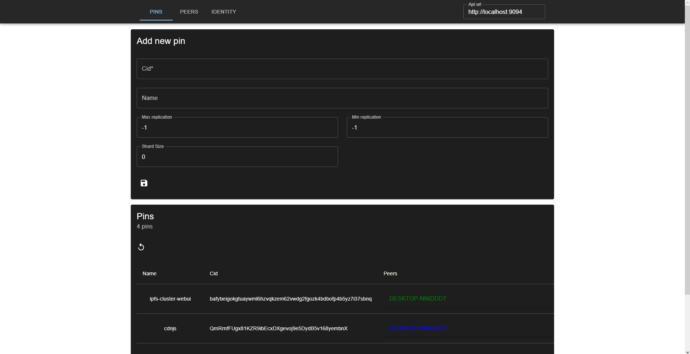

# IPFS Toolbox

You can check it out right [here](http://ipfs-toolbox.on.fleek.co/).
Or you can follow the instructions below and build it yourself.

## Shortcuts

- `ctrl` + `h` - Go to dashboard.
- `ctrl` + `,` - Go to configuration.
- `ctrl` + `m` - Toggle menu.
- `ctrl` + ` ` - Toggle search.

## Notes

**Cluster webui**
The `service.json` file will have to have `restapi.cors_allowed_methods` with at least the values `["GET","POST","DELETE"]`.
Or updating/adding/deleting will not work.

## Getting started

1. Clone this repository
2. install dependencies with `yarn install`
2. start the toolbox `yarn start`
